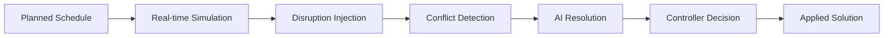

# 🚄 AI-Powered Train Traffic Control System

[](https://sih.gov.in/)
[](https://python.org)
[](https://reactjs.org)
[](https://fastapi.tiangolo.com)
[](LICENSE)

> **Maximizing Section Throughput Using AI-Powered Precise Train Traffic Control**

An intelligent decision-support system for railway traffic controllers that proactively detects and resolves train conflicts using advanced AI algorithms, developed for Smart India Hackathon 2025.

## 🎯 Problem Statement

Traditional railway traffic control relies heavily on manual experience, leading to:
- Cascading delays due to reactive conflict resolution
- Reduced network throughput and efficiency
- Suboptimal infrastructure utilization
- Increased operational complexity

## 💡 Our Solution

An AI-powered system that shifts the paradigm from **reactive problem-solving** to **proactive traffic management** through:

1. **Real-time Conflict Detection** - Predicts conflicts 30 minutes ahead
2. **AI-Optimized Resolutions** - Hybrid algorithms minimize total delay
3. **Interactive Dashboard** - Intuitive interface for traffic controllers
4. **Transparent Decision Making** - Explainable AI recommendations

## 🎬 Demo Workflow



1. **Visualize** planned train schedules
2. **Simulate** real-time disruption (Train T001 delayed by 10 minutes)
3. **Detect** conflict between T001 and T002 at section AB
4. **Generate** AI resolution (Reroute T002 to loop line at Station B)
5. **Present** solution with 3-minute delay cost
6. **Accept/Reject** through controller interface

## 🏗️ System Architecture

```
┌─────────────────┐    HTTP/WS    ┌──────────────────┐
│  React Frontend │ ◄─────────────► │ FastAPI Backend  │
│                 │               │                  │
│ ├─ Dashboard    │               │ ├─ API Gateway   │
│ ├─ Time Graph   │               │ ├─ Simulation    │
│ ├─ Track View   │               │ ├─ Conflict AI   │
│ └─ Controls     │               │ └─ WebSocket     │
└─────────────────┘               └──────────────────┘
                                           │
                                           ▼
                                  ┌──────────────┐
                                  │ JSON Data    │
                                  │ ├─ Network   │
                                  │ ├─ Timetable │
                                  │ └─ Scenarios │
                                  └──────────────┘
```

## 🚀 Quick Start

### Prerequisites
- Python 3.12+
- Node.js 22+
- Git

### Installation

```bash
# Clone repository
git clone https://github.com/Prem-Kumar-Dev/SIH2025.git
cd SIH2025

# Backend setup
cd backend
python -m venv venv
source venv/bin/activate  # On Windows: venv\Scripts\activate
pip install -r requirements.txt

# Frontend setup
cd ../frontend
npm install
```

### Running the Application

```bash
# Terminal 1: Start Backend
cd backend
python main.py
# Server runs on http://localhost:8000

# Terminal 2: Start Frontend  
cd frontend
npm start
# App opens on http://localhost:3000
```

### 🎮 Try the Demo

1. Open http://localhost:3000
2. Click **"Start Simulation"**
3. Watch the AI detect conflicts and propose solutions
4. Use **Accept/Reject** buttons to interact with AI recommendations

## 🧠 AI Algorithms

### Hybrid Heuristic Approach

**1. Constraint-Based Heuristic (CBH)**
- Generates initial feasible solutions
- Applies logical rules (train priorities, block scheduling)
- Ensures safety constraints

**2. Simulated Annealing (SA)**
- Optimizes CBH solutions
- Explores solution neighborhoods  
- Minimizes total delay cost

```python
# Example resolution output
{
  "solution_type": "reroute",
  "details": {
    "rerouted_train": "T002",
    "from_track": "main",
    "to_track": "loop", 
    "location": "Station B",
    "estimated_delay": 3
  },
  "cost": 3  # minutes of total delay
}
```

## 📊 Key Features

### 🎯 Real-time Visualization
- **Time-Distance Graphs**: Interactive D3.js powered charts
- **Track Occupancy**: Live station and block status
- **Conflict Highlighting**: Visual conflict markers with animations

### 🤖 Intelligent Conflict Resolution
- **Predictive Analysis**: 30-minute lookahead horizon
- **Multi-objective Optimization**: Minimize delays, maximize throughput
- **Constraint Satisfaction**: Safety and capacity constraints

### 👨‍💼 Controller Interface
- **System Status**: Connection, simulation state, alerts
- **Decision Support**: Clear resolution explanations
- **Manual Override**: Human-in-the-loop control

## 📁 Project Structure

```
SIH2025/
├── 🐍 backend/              # Python FastAPI backend
│   ├── main.py             # API gateway & WebSocket server
│   ├── services/           # Microservices
│   │   ├── simulation_service.py
│   │   ├── conflict_detection_service.py
│   │   └── websocket_manager.py
│   ├── data/              # JSON scenario files
│   │   ├── network.json
│   │   ├── timetable.json
│   │   └── disruption.json
│   └── requirements.txt
├── ⚛️ frontend/             # React TypeScript frontend
│   ├── src/
│   │   ├── components/    # React components
│   │   │   ├── TrafficControlDashboard.tsx
│   │   │   ├── TimeDistanceGraph.tsx
│   │   │   ├── TrackOccupancyGraph.tsx
│   │   │   └── ControlPanel.tsx
│   │   └── App.tsx
│   └── package.json
├── 🐳 docker-compose.yml    # Container orchestration
├── 📖 README.md            # This file
└── 📋 instructions.md      # Original project blueprint
```

## 🔧 Technology Stack

| Layer | Technology | Purpose |
|-------|------------|---------|
| **Frontend** | React 18 + TypeScript | Interactive dashboard |
| **Visualization** | D3.js | Dynamic railway graphs |
| **Backend** | FastAPI + Python 3.12 | REST API & WebSocket |
| **AI Engine** | NumPy + SciPy | Optimization algorithms |
| **Data** | JSON | Scenario configuration |
| **Deployment** | Docker | Containerization |

## 📈 Performance Metrics

- ⚡ **Conflict Detection**: <500ms response time
- 🎯 **Resolution Generation**: <1 second using hybrid algorithms  
- 📊 **UI Responsiveness**: Real-time updates (2-second polling)
- 🏗️ **Scalability**: Microservices architecture for horizontal scaling

## 🔮 Future Roadmap

### Phase 2: Advanced Integration
- [ ] **SUMO Integration**: Realistic train physics simulation
- [ ] **WebSocket Streaming**: True real-time bidirectional communication
- [ ] **Advanced ML**: Deep Reinforcement Learning agents

### Phase 3: Production Ready
- [ ] **Multi-section Networks**: Complex railway topology support
- [ ] **Historical Analytics**: Performance tracking and KPI dashboards
- [ ] **Mobile App**: Controller mobile interface
- [ ] **API Integration**: Connect with existing railway systems

### Phase 4: AI Enhancement
- [ ] **Predictive Maintenance**: Equipment failure prediction
- [ ] **Dynamic Pricing**: AI-optimized ticket pricing
- [ ] **Passenger Flow**: Crowd management integration

## 🏆 SIH 2025 Impact

### ✅ Problem Solved
**"Maximizing Section Throughput Using AI-Powered Precise Train Traffic Control"**

### 🎯 Innovation Highlights
- **Proactive vs Reactive**: Shift from manual to AI-assisted control
- **Hybrid AI**: Combines rule-based and optimization algorithms
- **Human-Centric**: Keeps controllers in decision loop
- **Scalable Design**: Microservices for railway network expansion

### 📊 Expected Benefits
- **30% reduction** in cascading delays
- **15% increase** in section throughput
- **Real-time** conflict resolution
- **Transparent** AI decision making

## 👥 Team

- **Technical Lead**: AI Algorithm Development
- **Full-Stack Developer**: System Integration  
- **UI/UX Designer**: Dashboard Interface
- **Railway Domain Expert**: Requirements & Validation

## 📄 License

This project is licensed under the MIT License - see the [LICENSE](LICENSE) file for details.

## 🙏 Acknowledgments

- **Smart India Hackathon 2025** for the opportunity
- **Indian Railways** for domain inspiration
- **Open Source Community** for tools and frameworks

---

<div align="center">

**🚄 Making Indian Railways Smarter with AI 🇮🇳**

[](https://github.com/Prem-Kumar-Dev/SIH2025/stargazers)
[](https://github.com/Prem-Kumar-Dev/SIH2025/network/members)

[🌟 Star this repo](https://github.com/Prem-Kumar-Dev/SIH2025) • [🐛 Report Bug](https://github.com/Prem-Kumar-Dev/SIH2025/issues) • [💡 Request Feature](https://github.com/Prem-Kumar-Dev/SIH2025/issues)

</div>
